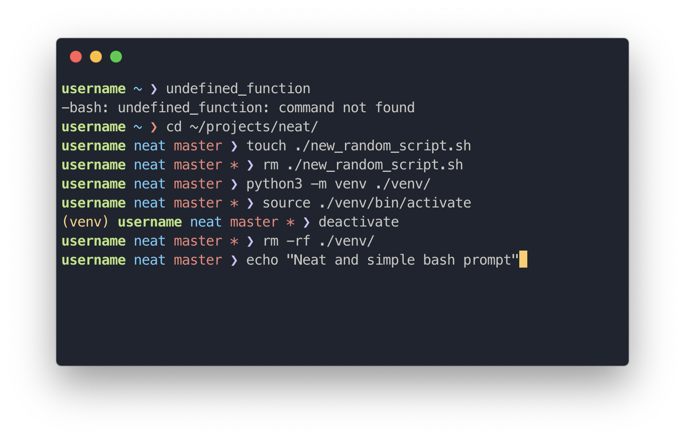

# *neat*

---

If you find ***neat*** inspiring, amazing, or even just interesting, please give it a ⭐️ to help the project grow.

---

**Neat, customizable, and blazing-fast bash prompt**

<div align="center">
    
</div>

## Why

- **Performance:** ***neat*** is really fast, much faster than Powerlevel10k and Powerlevel9k or even starship.rs due to extensive caching
- **Simple:** Using a simple and beautiful configuration script, ***neat*** is not just easy to configure, but versatile
- **Beautiful:** ***neat*** includes a beautiful configuration out of the box, with full customization of colors and an array of plugins
- **Extensible:** Intuitive plugin system with simple plugin manager allows ***neat*** to be easily extensible

## Installing

***neat*** is only functional on `bash` 4 or later, and has only been throughly tested on `bash` 5. To install, simply install with the following command.

```bash
curl -s https://raw.githubusercontent.com/HereIsKevin/neat/master/install.sh | bash
```

If you get `-bash: curl: command not found`, try using wget instead of curl.

```bash
wget -O - https://raw.githubusercontent.com/HereIsKevin/neat/master/install.sh | bash
```

If you have any concerns about the shell scripts, feel free to review them on [GitHub](https://github.com/HereIsKevin/neat)

## Contributing

The core of ***neat*** is currently not accepting contributions, though you are welcome to open issues and create your own plugins.
